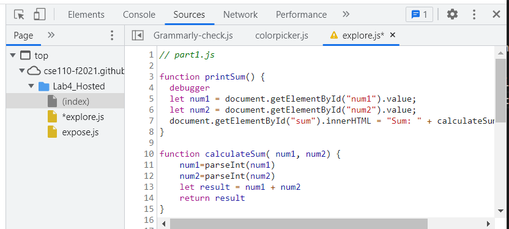

1. What was the bug?
   the calculateSum takes num1 and num2 as string. So the `+` operation just concatenates the two number string.
2. How would you fix it? Include a screenshot of your fix. Name it fix.png (or whatever image extension you would like to use)
   I use `parseInt()` to convert `num1` and `num2` to number before adding them up.
   